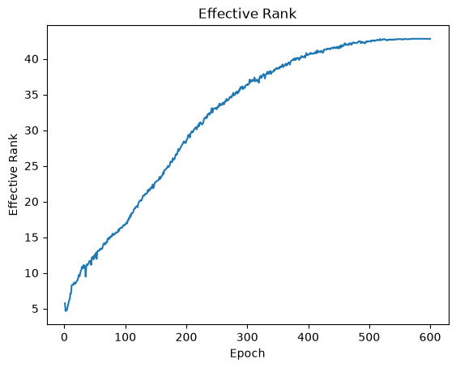
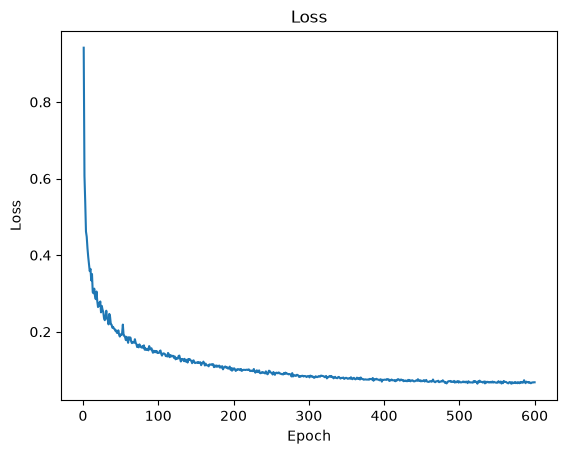
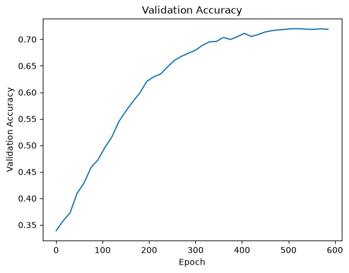
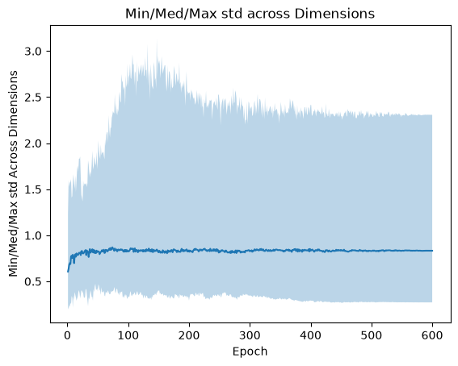

# LeJEPA Implementation

This is a recreation of the joint embedding predictive architecture (JEPA) described in [LeJEPA](https://arxiv.org/abs/2511.08544); trained on 
CIFAR-10 and using a ViT encoder. Written from the paper without using reference implementations or tutorials.

### Results

| encoder                                                                                         | probe acc (test) | internal head acc (test) | erank    | \|cos\|   |
|-------------------------------------------------------------------------------------------------|------------------|--------------------------|----------|-----------|
| [LeJEPA (600 epochs)](https://www.kaggle.com/code/arnavnagpure/lejepa-exp-main)                 | **72.4%**        | -                        | **42.9** | **0.106** |
| [Random init ViT baseline](https://www.kaggle.com/code/arnavnagpure/lejepa-exp-random-init-vit) | 34.3%            | -                        | 4.24     | 0.457     |
| [CNN baseline](https://www.kaggle.com/code/arnavnagpure/lejepa-exp-cnn-baseline)                | -                | 80.0%                    | -        | -         |

<table>
  <tr>
    <td></td>
    <td></td>
  </tr>
  <tr>
    <td></td>
    <td></td>
  </tr>
</table>

### Method

The training dataset used was CIFAR-10 (50K train and 10K test each 32x32 images), in which train was split into 45K train and 5K val. The dataset was downloaded from HuggingFace instead of UofT due to slow download speeds. The dataset also gets preprocessed, formatted and validated with the hash of its contents, shape and dtype. Once downloaded the data is stored at `lejepa/data`. All data handling functions can be found at [data.py](lejepa/data.py).

The rough train pipeline is as follows:
```
Transform Images (create views) -> Embed Views -> Compute loss using views
```
To create views, 4 torchvision v2 transforms were chained: `RandomResizedCrop`, `ColorJitter`, `RandomGrayscale` and `RandomHorizontalFlip`. The implementation can be found in [augment.py](lejepa/augment.py) and the configs at [config.py](lejepa/config.py) within `AugementConfig`.


To embed image view pairs I used a [ViT](lejepa/ViT.py), implemented from scratch, including patch embeddings, layer normalisation and multi headed attention.


The loss was computed by comparing two global views against each other, local views omitted for simpliciy, and calculating their mean/center. The square distance between each embedding and its center with its pair were averaged across a batch forming the similarity loss `sim_loss`.


The batches of embedded views were then fed into [sigreg](lejepa/sigreg.py) which calculated a loss based on how closely distributed they were to an isotropic Gaussian. This was sketched using 64 random directions and projecting all of the points onto these directions. Each projection's emperical characteristic function was computed and compared against the CF for `N(0, 1)` in the Epps Pulley statistic. The mean was calculated and the result returned as `sig_loss`.


The final loss was calcuated in [loss.py](lejepa/loss.py) with a hyperparameter λ:
```
lejepa = λsig_loss + (1-λ)sim_loss
```


[Training](lejepa/train.py) uses AdamW with peak lr at (4e-4) and involves a warmup `LinearLR`, followed by `CosineAnnealingLR`. It also used a batch size of 256 and 600 epochs. Each epoch the effective rank, loss, lr, mean pairwise cosine and stds are logged. The validation accuracy is logged every 15 epochs.


### Collapse instrumentation

Representation collpase is a common issue in SSL and was no different here. SIGReg could diagnose _a failure_ but could not tell _what failure_; as such, more complex [metrics](lejepa/metrics.py) had to be used such as effective rank and mean pairwise cosine.

Effective rank was calculated as decribed in [**Effective Rank**](https://infoscience.epfl.ch/server/api/core/bitstreams/2907ab8a-23f5-481d-bb07-1d56a3f3511f/content) by Roy and Vetterli:
```
erank(A) = exp {H(p_1, p_2, . . . , p_Q)} 
```
Where p_1 ... p_Q are the normalised eigenvalues of the covariance matrix. Both mean pairwise cosine and effective rank were [evaluated](scripts/evaluate_metrics.py) with known failure distributions:

| Distribution | Effective Rank | MP Cos        |
|--------------|----------------|---------------|
| Rank 1       | 1.0000         | 1.0000        |
| Rank 5       | 4.9020         | 0.3794        |
| Rank 40      | 35.5551        | 0.1398        |
| Single Point | 1.0000         | 1.0000        |
| Offset       | 187.5891       | 0.9902        |
| 0.01 Scale   | 187.5907       | 0.0576        |


### Limitations

More baselines are needed such as a supervised ViT run and ablations including no sigreg loss and no sim loss. Additionally the codebase is coupled to using both a ViT and torchvision transforms as well as the CIFAR-10 dataset.


The view pipeline should also be improved since the views do not use the multi crop implementation described in paper. Additionally the pipeline uses only 2 global views instead of 2 global and 6 local.


The model should also be evaluated on another dataset to properly test semantic understanding, as well as running each test multiple times with mutiple seeds.


Model optimisations should also be applied to reduce train time, currently the project is working but unoptimised and only using a single GPU when kaggle allows for 2 T4s.


### Reproducability

All experiments are avaliable and free to run on Kaggle. Each notebook imports the repository and runs each experiment as normal, using a preprocessed dataset and setting output to Kaggle working. The link to each can be found in each file's docstring or below:
- [Main](https://www.kaggle.com/code/arnavnagpure/lejepa-exp-main)
- [CNN Baseline](https://www.kaggle.com/code/arnavnagpure/lejepa-exp-cnn-baseline)
- [Untrained ViT](https://www.kaggle.com/code/arnavnagpure/lejepa-exp-random-init-vit)
